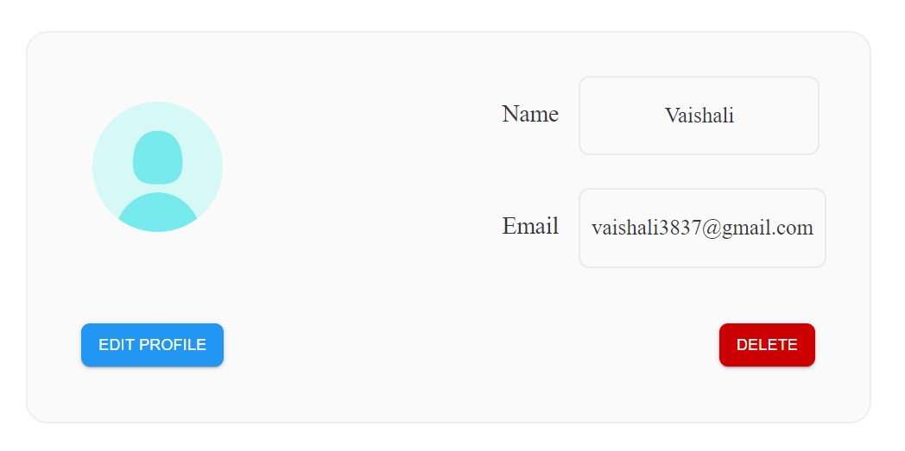
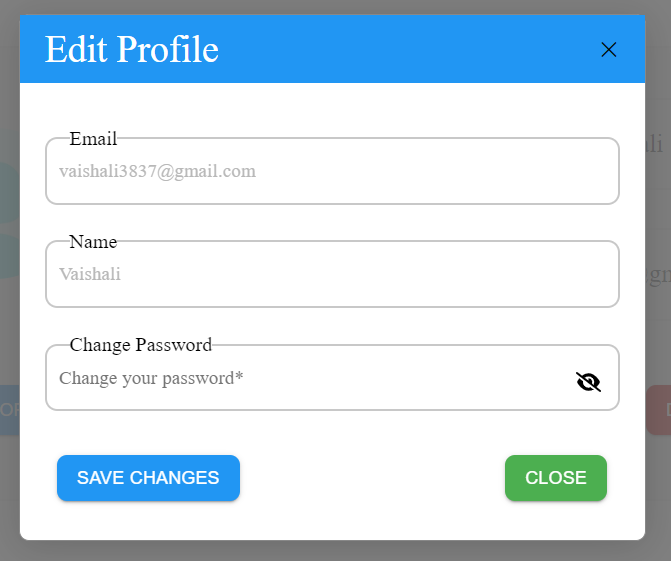
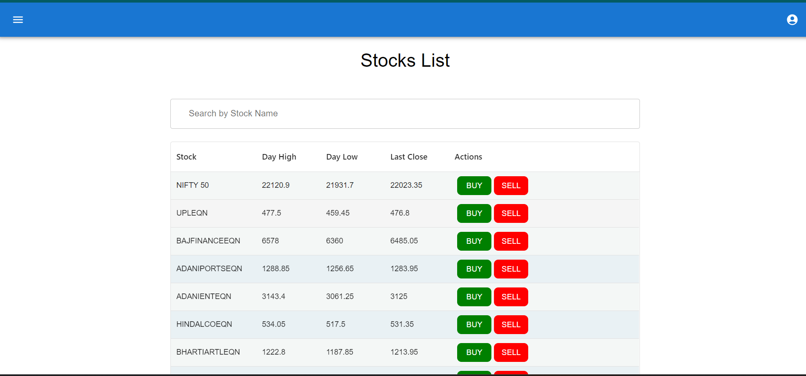

## Setup Instructions

1. Clone this repository.

   ```bash
   $ git clone https://github.com/JunihersGroup4/VTPFrontend.git
   ```

2. Run the below commands.

   ```bash
   $ yarn install
   $ yarn start
   ```

## Pages in the Application

1. Login
2. SignUp
3. Profile
4. TradePage
5. WatchList
6. Portfolio
7. History

## 3. Profile

<div style="text-align: center;">
    
    
</div>

### Key Features:

1. **User Identification:** Displays the user's name and email for easy identification.
2. **Editing Functionality:** Allows users to edit their profile (name, email, password) information conveniently.
3. **Account Deletion:** Provides the functionality to securely delete the user account.

## 4. Trade Page

<div style="text-align: center;">
    
</div>

### UI Features:

1. **Sortable Columns:** Each column in the table can be sorted. (_Add other Material UI table functions as needed_)
2. **Stock Search:** Users can search for a particular stock.
3. **Adjustable Column Count:** Users can customize the number of columns displayed per stock.

### Key Features:

1. **Stock Trading:** Users can conveniently buy and sell stocks.
2. **Real-time Market Data:** Market data is refreshed periodically for up-to-date information. (Every 2 minutes)

### Market Data Details:

- **Change:** Represents the absolute difference between the current price of the stock and its previous close.
- **%Change:** Indicates the percentage change in the price of the stock compared to its previous close.
