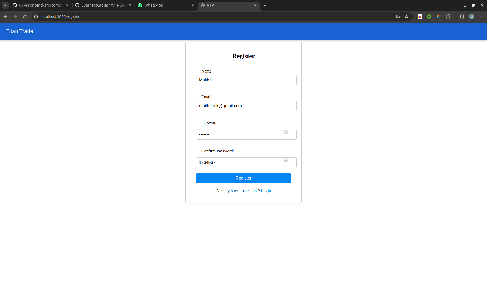
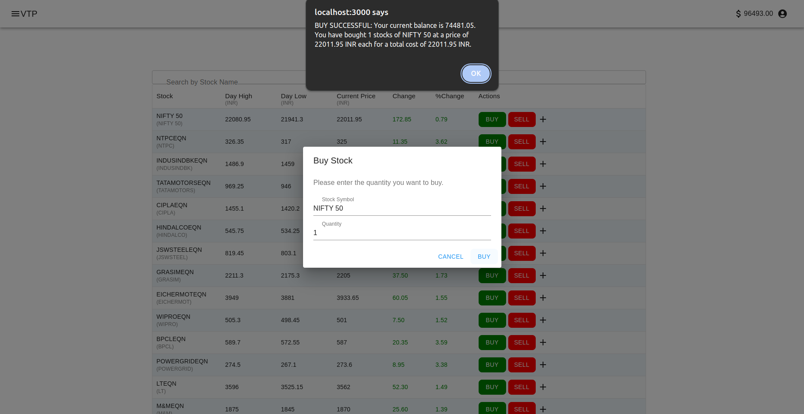
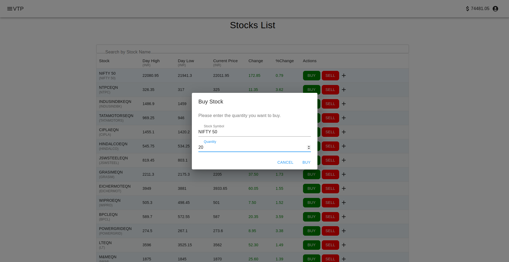
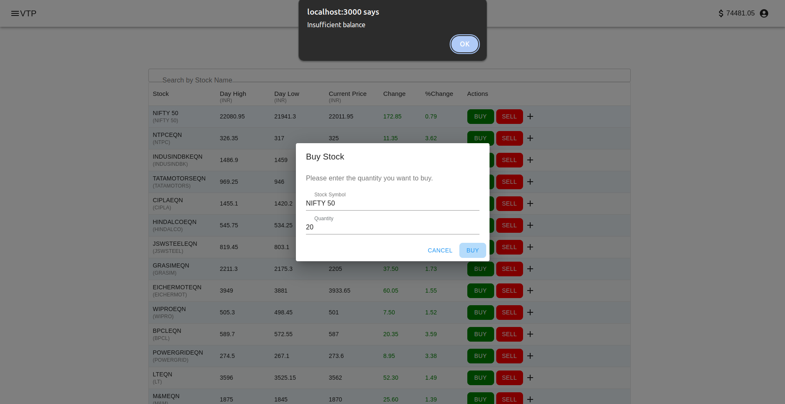
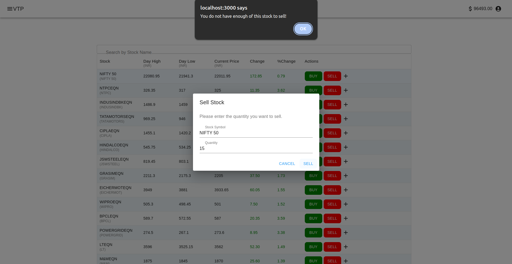
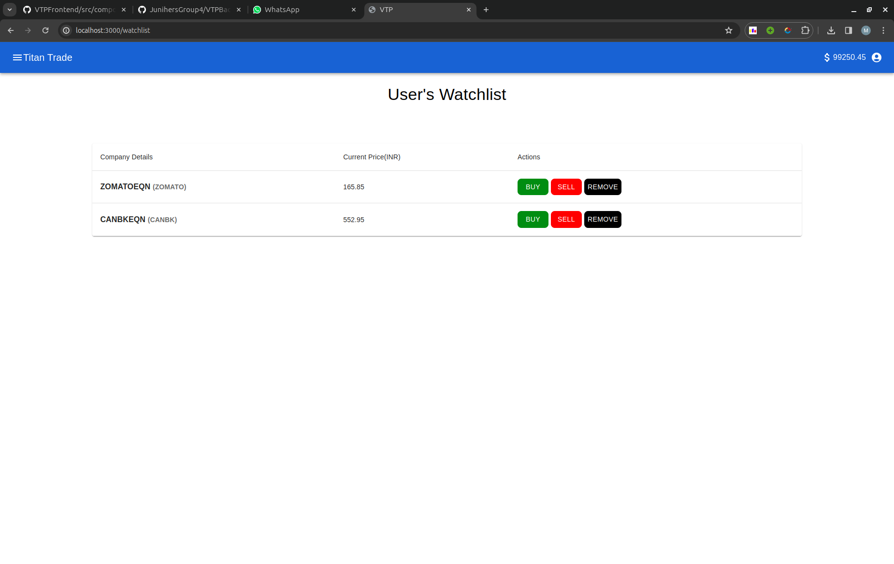
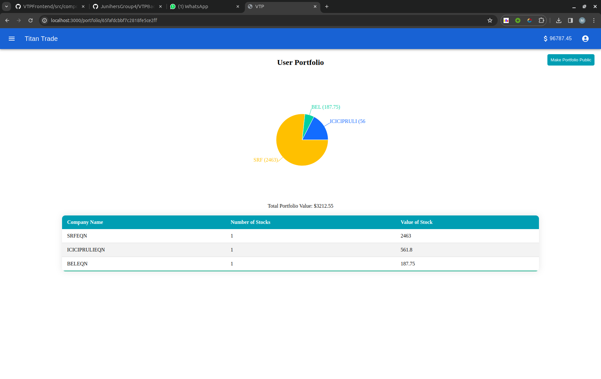
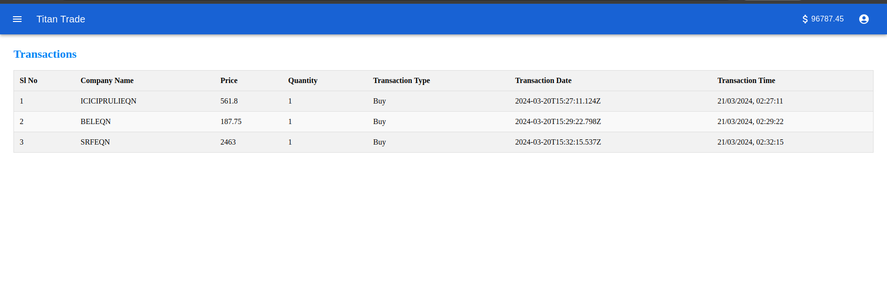

## Setup Instructions

1. Clone this repository.

    ```bash
    $ git clone https://github.com/JunihersGroup4/VTPFrontend.git
    ```
2. Get into the repository directory.

    ```bash
    $ cd VTPFrontend
    ```

3. Run the below commands.

   ```bash
   $ yarn install
   $ yarn start
   ```

## Pages in the Application

1. Login
2. SignUp
3. Profile
4. TradePage
5. WatchList
6. Portfolio
7. History

## Login

<div style="text-align: center;">
    
</div>

## Sign Up

<div style="text-align: center;">
    
</div>

### Key Features

1.  Prevents duplicate email registrations.
2.  Sets portfolios to private by default upon signup.
3.  Passwords are securely hashed using bcrypt.
4.  Access control:
       - Logged-in users cannot access register and login pages.
       - Logged-out users cannot access tradePage, private portfolio, watchlist, and history.


<div style="text-align: center;">
    
    
</div>

### Key Features:

1. **User Identification:** Displays the user's name and email for easy identification.
2. **Editing Functionality:** Allows users to edit their profile (name, email, password) information conveniently.
3. **Account Deletion:** This feature provides the functionality to securely delete user accounts, while also allowing authorized personnel (with database access) to recover accounts if needed.

## Trade Page

<div style="text-align: center;">
    
</div>

### Buy

#### Buy Modal Window:
<div style="text-align: center;">
    
</div>

#### Successful Buy:
<div style="text-align: center;">
    
</div>

#### Buy Modal (with larger order amount than balance):
<div style="text-align: center;">
    
</div>

#### Failed  Buy:
<div style="text-align: center;">
    
</div>

### Sell

#### Sell Modal Window:
<div style="text-align: center;">
    
</div>

#### Successful Sell:
<div style="text-align: center;">
    
</div>

#### Sell Modal (with insufficient number of stocks in possession):
<div style="text-align: center;">
    
</div>

#### Failed  Sell:
<div style="text-align: center;">
    
</div>

### UI Features:

1. **Sortable Columns:** Each column in the table can be sorted.
2. **Stock Search:** Users can search for a particular stock.
3. **Adjustable Column Count:** Users can customize the number of columns displayed per stock.

### Key Features:

1. **Stock Trading:** Users can conveniently buy and sell stocks. These are updated, and the user can see the balance change reflected in the navbar on successful buy or sell.
2. **Real-time Market Data:** Market data is refreshed periodically for up-to-date information. (Every 2 minutes)

### Market Data Details:

- **Change:** Represents the absolute difference between the current price of the stock and its previous close.
- **%Change:** Indicates the percentage change in the price of the stock compared to its previous close.

## Watchlist

<div style="text-align: center;">
    
</div>

### Key Features:

1. **Stock Trading:** Users can conveniently buy and sell stocks added to their Watchlist.
2. **Real-time Market Data:** Market data is refreshed periodically for up-to-date information. (Every 2 minutes)
3. **Edit Watchlist:** Users can conveniently remove stocks from their Watchlist.

### Market Data Details:

- **Current Price:** Represents the last close Value of a stock

## Portfolio

<div style="text-align: center;">
    
</div>

### UI Features:

1. **Sortable Column:** Sortable stock value column in ascending or descending order for better understanding of most and least performing stocks
2. **Pie Chart:** Pie Chart representation of portfolio breakdown to better visualise the stock breakdown

### Key Features:

1. **Portfolio:** Users can conveniently see their Portfolio value and see the shares bought by them.
2. **Sharable Portfolio:** Users can conviniently share their portfolio by sharing the portfolio page link and making their portfolio public.
3. **Portfolio Confidentiality:** Users can make their Portfolio private and prevent other people from being able to view their portfolio


## Transaction History

<div style="text-align: center;">
    
</div>
